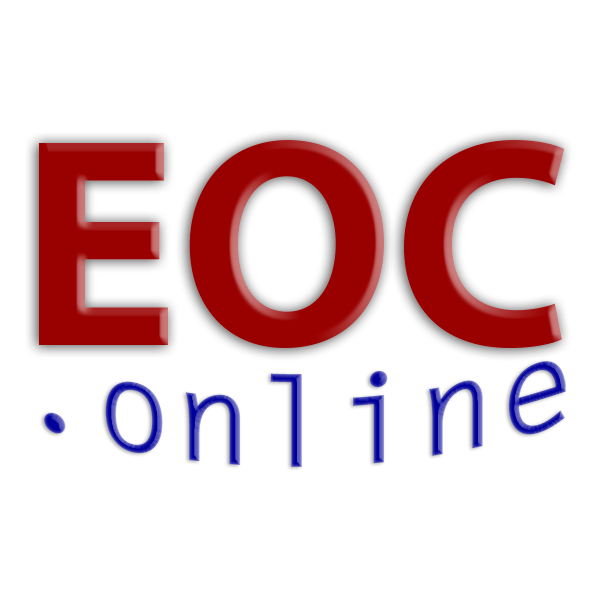
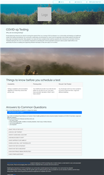

# EOC.online

{: .align-right}

> "Helping you help others!"

## About

> Transform your EOC operations from chaotic to focused!

EOC.Online's primary goal has been to make it easy for you to install and use a standards
based website for your emergency operations center. Whether yours is small or large,
private or public, we offer a flexible, extensible, secure set of options customized for
your Emergency Operations Center's needs. Our software is based on free, open source,
robust code that runs on a laptop, a server farm, or in the cloud.

We've also focused on other tools and projects recently:

## Projects

EOC.online currently is working on a few efforts - with others now archived.

### Open Source, Standards Based Web Sites for Emergency Operations Centers

We started working on open source, free websites to serve as a template for your
community's Emergency Operations Center's use. The goal is to provide sophisticated tools
that simplify your staff and volunteers effort during disasters. Easy navigation and
workflows mirror ICS & NIMS guidance for typical EOCs. Each community is encouraged to
customize their own website to match local risks, special populations, and other
circumstances.

EOC.online is a flexible, free, toolset for creating your own NIMS/ICS based EOC website.
Set up a usable, working web site in minutes, and then customize it based on your
community experience in the years ahead!

### RangerTrak™

> Track & map search & rescue members reporting via radio, without reliable cell or
> internet access

The RangerTrak™ application aids tracking & mapping CERT, ACS, wildland firefighters &
other teams, 'rangers' & individuals roaming around, who are only reliably connected via
HAM radio or other non-data supporting means. Teams or individuals can radio in their
locations - in a variety of formats, and be centrally tracked. A single log of reports,
locations, events and time is created for documentation and analysis. Most critically
search area coverage can be determined and teams/individuals that have NOT reported in can
be monitored.

This Progressive Web Application, or PWA, will largely run even if there is inconsistent,
limited, or no cell, internet or data access at the command post. It runs entirely in a
device's browser, allowing operation on most any simple, modern, basic web brower in the
field. Rangers can radio in their locations - using a variety of location codes, and be
centrally tracked.

Verbally transmitting & transcribing latitude & longitude coordinates can be very error
prone and slow. Instead RangerTrak also permits other ways to report locations: by Street
Address, Google PlusCodes, and perhaps What3Words. See
<https://en.wikipedia.org/wiki/Open_Location_Code#Other_geocode_systems> for a list.

### OpenFemaNgClient™

{: .align-right}

> A TypeScript & Angular Client for the openFEMA datasets/APIs

openFemaNgClient is an Angular (aka Ng) & Typescript (thus ubiqitious JavaScript)
browser-only client application to provide an example for accessing one (currently) of the
<a href="https://www.fema.gov/about/reports-and-data/openfema" target="blank"
title=" https://www.fema.gov/about/reports-and-data/openfema">OpenFEMA datasets</a>.

A working version/demo is (planned for now) at:
<a href="https://eocsw.org" target="_blank" title="<http://eocsw.org>">http://eocsw.org</a>.
(No $ to make it a https (secure) site for now.) Initially this is a proof of concept,
with encouragement it could be fortified into an enterprise ready tool.

### COVID-Testing Web Page

> A free, readily modifed and deployable standards based web page for the COVID Rural
> Testing & Tracing Toolkit (RT3).

#### RT3 - Rural Testing & Tracing Toolkit

{:
.align-right}

One of these is the COVID Rural Testing & Tracing Toolkit (RT3), that provides rural
communities a proven toolkit for conducting their own COVID testing for local residents
outside a formal hospital setting.

Vashon's MRC is making freely available their pioneering simple, no frills COVID-19
testing set-up that follows CDC guidence and can still be run by volunteers with proper
training.

We are making this available to other communities around the world as a model. Learn more
at www.VashonBePrepared.org/Testing

Within this larger context above, this particular GitHub repository, at
www.github.com/EOCOnline/Covid-Testing, provides a standards based, easily replicated web
page that can be integrated into your existing website, and easily branded to assure your
visitors.

Read more at: <https://github.com/EOCOnline/COVID-Testing>
