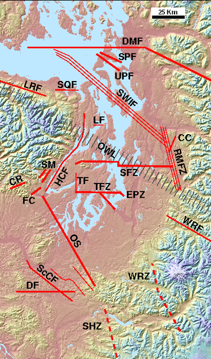

 If you’ve not seen it, there is a good map of local faults, with a brief write-up at [www.pnsn.org/INFO_GENERAL/puget_faults.html](http://www.pnsn.org/INFO_GENERAL/puget_faults.html "http://www.pnsn.org/INFO_GENERAL/puget_faults.html")

Click on the image for a larger view.
