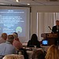

 The WA State Emergency Managers Association annual conference was held this last week and some of the materials from that are now available online for any of us who were unable to make the conference.

Presentation slides and photos from the conference are available at the WSEMA website at [www.wsema.org](http://www.wsema.org) .  See "2010 Conference Presentations" on the left side menu.

The videos embedded in Claire Bonilla's Microsoft presentation were too large to load onto the WSEMA website. For more information, go to the Microsoft Citizen Safety Architecture website at [http://www.microsoft.com/csa](http://www.microsoft.com/csa) and to the following websites for information on the Eagle solution [http://www.geodan.com/markets/public-order-and-safety/eagle/](http://www.geodan.com/markets/public-order-and-safety/eagle/) and [http://www.geodan.com/markets/public-order-and-safety/eagle-download/](http://www.geodan.com/markets/public-order-and-safety/eagle-download/)

Many of the photos are also available on FLICKR at [http://bit.ly/c3O9dd](http://bit.ly/c3O9dd)
