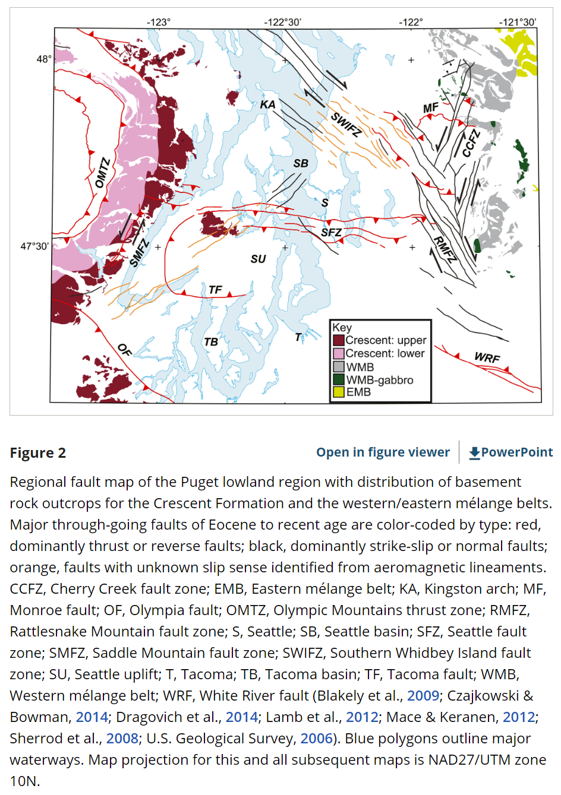

The Seattle fault zone is a network of shallow faults slicing through the lowlands of Puget Sound, threatening to create damaging earthquakes for the [more than four million](https://censusreporter.org/profiles/31000US42660-seattle-tacoma-bellevue-wa-metro-area/) people who live there. A new origin story, proposed by Washington State Department of Natural Resources geophysicist Megan Anderson and others in [a new study](https://agupubs.onlinelibrary.wiley.com/doi/10.1029/2022TC007720), could explain the fault system’s earliest history and help scientists improve hazard modeling for the densely populated region.

### Study by DNR geophysicist suggests hazardous Seattle Fault Zone developed as the edge of the continent split more than 50 million years ago

The study was published in _Tectonics_, AGU’s journal for research exploring the evolution, structure and change of Earth’s crust and upper mantle. It suggests that an island chain was pulled towards the larger continent about 55 million years ago, ran into the North American plate and split into two, with part of the chain going over the top of the crust layer, and the rest getting sucked underneath it. Study authors posit that this split set the stage for the modern Seattle fault.

The study has 3 key points:

- Includes map interpretation and models of the upper crust utilizing constraints from gravity, aeromagnetics, seismology and geology
- Modeled structures show an accretionary fold and thrust belt, wrapping around the northern edge of an obducted northern margin of Siletzia
- Interpreted structures suggest the Seattle fault could have an earliest Eocene history as a tear fault within the fold and thrust belt

“This fascinating study from one of our geophysicists at the Department of Natural Resources could shape understanding of this region for the next generation,” said **Commissioner of Public Lands, Hilary Franz**.

“It was a total surprise,” said **Anderson, lead author on the study and a geophysicist with the Washington Geological Survey, a division of DNR**. “It wasn’t something we were going for originally, but our results predict a major ancient fault where the Seattle fault is today.”

**A massive mystery**

The Pacific Northwest lies just inland from the Cascadia subduction zone, where dense oceanic crust gets pulled under the continent. In 1700, a roughly 1000-kilometer (620-mile) rupture of the subduction zone created a massive quake between magnitude 8.7 and 9.2. Smaller quakes shook the region throughout the 1900s – most recently during the [2001 Nisqually earthquake](https://www.seattletimes.com/seattle-news/science/20-years-after-the-nisqually-earthquake-are-we-better-prepared-for-the-big-one/). The Seattle fault [ruptured in 923-924 AD](https://www.science.org/doi/full/10.1126/sciadv.adh4973), based on local Indigenous oral traditions and geologic evidence along the Puget Sound shoreline.

Despite the region’s seismic activity, scientists didn’t begin to study the Seattle fault zone in earnest until the 1990s.

“There’s a lot more uncertainty about the Seattle fault than, for example, the San Andreas fault,” Anderson said. “The Seattle fault could generate something like a magnitude 7.2 earthquake, and we want to be prepared for it. There’s still a lot to learn so that engineering geologists can do better simulations for earthquakes and understand the potential risks to our communities.”

Previous work to determine the geometry of the Seattle fault at depth relied primarily on seismic data, which are sound waves traveling through and being reflected by underground layers of rock. The data revealed faults and geologic structures that seismologists and geologists interpreted differently. They knew the region hosted a major fault zone, but scientists had proposed different ways parts of the fault are connected, how deep it extends, and how steeply it cuts through the bedrock.

Magnetic data revealed a key secret seismic data point previously missed: deep in the crust, the bedrock consistently alternates between being more and less magnetic, suggesting slanted layers of changing rock type. In a map-based view, features on either side of the Seattle faut zone angle away from each other – north of the Seattle fault zone, structures are angled north-northwest, while in the south, they’re oriented north-northeast.

Those wonky orientations gave Anderson pause; they hinted at an ancient mountain range. To connect the map view with known, deeper bedrock geology, Anderson modeled a vertical profile of rocks underground and found some of those structures dip at different orientations underground, too.

“These are all very different orientations,” Anderson said. “It’s very hard to do that unless there’s a place where the structures get disconnected from each other and then restart.”

**A tear in the crustal continuum**

The data suggested that about 55 million years ago, as the subduction zone pulled in a string of oceanic islands, the northern half of the island chain was subducted, but the southern half was added to the top of the crust, or obducted.

As the islands were obducted over millions of years, they crumpled into a fold-and-thrust mountain belt with topography like the Blue Ridge Mountains of Appalachia. The zone where the islands switched from being subducted to being accreted would have been under incredible strain and been ripped apart.

“It would have been this slow, ongoing tear, almost like the crust unzipping itself,” Anderson said. “As this progressed, the tear fault got longer and longer.”

The “torn” region overlaps perfectly with the modern Seattle fault zone. The intense tearing stopped after the islands were crunched into the continent, but the zone of intense tearing created fragmented, weakened crust, setting the geologic stage for the modern Seattle fault zone.

Beyond offering a possible explanation for why the fault zone exists, the study’s results about the geometry of Washington’s more ancient faults and geologic structures provide valuable details about the bedrock under and within the Seattle basin. This basin is filled with kilometers of looser sedimentary rock which make seismic ground shaking stronger, and the new data can help scientists make more accurate models of future ground shaking in the area.

"This buried tectonic story was so much fun to discover, and now it will provide a great basis for getting back to answering our original questions about active fault geometry for the Seattle fault and other faults in western Washington,” Anderson said.

**\----**

This study is published in _Tectonics_, with free access provided for 30 days after publication. Neither the study nor this press release is under embargo. [View and download a pdf of the study here](https://agupubs.onlinelibrary.wiley.com/doi/10.1029/2022TC007720).

**Paper title:**

“Deep structure of Siletzia in the Puget Lowland: Imaging an obducted plateau and accretionary thrust belt with potential fields”

Authors:

- Megan L. Anderson (corresponding author), Washington Geological Survey, Olympia, WA, USA
- Richard .J. Blakeley, Ray E. Wells, USGS, Portland, OR, USA
- Joe D. Dragovich, Dragovich Geo-Consulting, Lacey, WA, USA

\- From: [https://www.dnr.wa.gov/news/study-shows-seattle-fault-may-have-origins-ancient-tear-continent](https://www.dnr.wa.gov/news/study-shows-seattle-fault-may-have-origins-ancient-tear-continent "https://www.dnr.wa.gov/news/study-shows-seattle-fault-may-have-origins-ancient-tear-continent")

