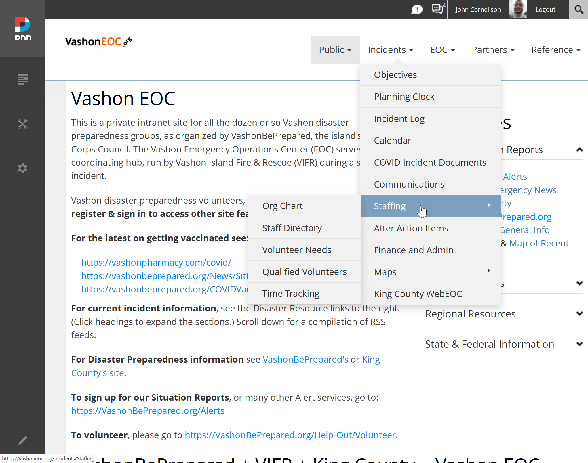

## FEMA.gov Sitemap

### What's a Sitemap?

As noted [here](./eoc-sitemap.md),

_"Technically, a sitemap is a plain text file (albeit with a [special format](https://developers.google.com/search/docs/crawling-indexing/sitemaps/overview)) that lists pages in your website that you want search engines to crawl and add to their results database._

_"A sitemap can also be used to quickly outline your (current or planned) website. Being abstract, it is easy to move or rearrange a website's structure for discussion purposes. It can be represented as a mindmap, but for our purposes a basic outline of pages will suffice. Each line of the outline could be a main menu heading, a section, a page, or even a portion of a page._

### FEMA.gov Sitemap Visualized

The FEMA site is mammoth, and like eating an elephant its best to proceed a bit at a time.

<!--figure>
  

<iframe title="Octopus.do visual sitemap" width="99%" height="750" src="https://share.octopus.do/embed/feddm224pr4"></iframe>
  <!--figcaption><h4>An elephant at sunset</h4></figcaption>
</figure-->

The top-level pages can be expressed as:

English

Spanish

Other Languages (French, ...)
